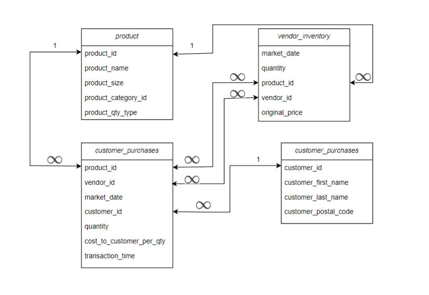

# Assignment 1: Meet the farmersmarket.db and Basic SQL

🚨 **Please review our [Assignment Submission Guide](https://github.com/UofT-DSI/onboarding/blob/main/onboarding_documents/submissions.md)** 🚨 for detailed instructions on how to format, branch, and submit your work. Following these guidelines is crucial for your submissions to be evaluated correctly.

#### Submission Parameters:
* Submission Due Date: `January 25, 2025`
* Weight: 30% of total grade
* The branch name for your repo should be: `assignment-one`
* What to submit for this assignment:
    * This markdown (Assignment1.md) with written responses in Section 4
    * One Entity-Relationship Diagram (preferably in a pdf, jpeg, png format).
    * One .sql file 
* What the pull request link should look like for this assignment: `https://github.com/<your_github_username>/sql/pulls/<pr_id>`
    * Open a private window in your browser. Copy and paste the link to your pull request into the address bar. Make sure you can see your pull request properly. This helps the technical facilitator and learning support staff review your submission easily.

Checklist:
- [ ] Create a branch called `assignment-one`.
- [ ] Ensure that the repository is public.
- [ ] Review [the PR description guidelines](https://github.com/UofT-DSI/onboarding/blob/main/onboarding_documents/submissions.md#guidelines-for-pull-request-descriptions) and adhere to them.
- [ ] Verify that the link is accessible in a private browser window.

If you encounter any difficulties or have questions, please don't hesitate to reach out to our team via our Slack. Our Technical Facilitators and Learning Support staff are here to help you navigate any challenges.

*** 

## Section 1:
You can start this section following *session 1*.

Steps to complete this part of the assignment:
- Load the farmersmarket.db and browse its content
- Create a logical data model

<br>
If this is your first time in DB Browser for SQLite, the following instructions may help:

#### 1) Load Database
- Open DB Browser for SQLite
- Go to File > Open Database
- Navigate to your farmersmarket.db 
	- This will be wherever you cloned the GH Repo (within the **SQL** folder)
	- 

#### 2) Configure your windows
By default, DB Browser for SQLite has three windows, with four tabs in the main window and three tabs in the bottom right window
- Window 1: Main Window (Centre)
	- Stay in the Database Structure tab for now
- Window 2: Edit Database Cell (Top Right)
- Window 3: Remote (Bottom Right)
	- Switch this to DB Schema tab (very bottom)

Your screen should look like this (or very similar)


#### 3) The farmersmarket.db
There are 10 tables in the Main Window:
1) booth
2) customer
3) customer_purchases
4) market_date_info
5) product
6) product_category
7) vendor
8) vendor_booth_assignments
9) vendor_inventory
10) zip_data

Switch to the Browse Data tab, booth is selected by default


Using the table drop down at the top left, explore some of the contents of the database


Move on to the Logical Data Model task when you have looked through the tables


### Build Logical Data Model

Recall during session 1:

I diagramed the following four tables:
- product
- product_category
- vendor
- vendor_inventory

 


#### Prompt 1:
Choose two tables and create a logical data model. There are lots of tools you can do this (including drawing this by hand), but I'd recommend [Draw.io](https://www.drawio.com/) or [LucidChart](https://www.lucidchart.com/pages/). 

A logical data model must contain:
- table name
- column names
- relationship type

Please do not pick the exact same tables that I have already diagrammed. For example, you shouldn't diagram the relationship between `product` and `product_category`, but you could diagram `product` and `customer_purchases`.

**HINTS**:
- You will need to use the Browse Data tab in the main window to figure out the relationship types.
- You can't diagram tables that don't share a common column
	- These are the tables that are connected
	- 
- The column names can be found in a few spots (DB Schema window in the bottom right, the Database Structure tab in the main window by expanding each table entry, at the top of the Browse Data tab in the main window)

***

**ANSWER**



## Section 2:
You can start this section following *session 2*.

Steps to complete this part of the assignment:
- Open the assignment1.sql file in DB Browser for SQLite:
	- from [Github](./02_activities/assignments/assignment1.sql)
	- or, from your local forked repository  
- Complete each question

### Write SQL

#### SELECT
1. Write a query that returns everything in the customer table.
2. Write a query that displays all of the columns and 10 rows from the customer table, sorted by customer_last_name, then customer_first_ name.

<div align="center">-</div>

#### WHERE
1. Write a query that returns all customer purchases of product IDs 4 and 9.
2. Write a query that returns all customer purchases and a new calculated column 'price' (quantity * cost_to_customer_per_qty), filtered by vendor IDs between 8 and 10 (inclusive) using either:
	1.  two conditions using AND
	2.  one condition using BETWEEN

<div align="center">-</div>

#### CASE
1. Products can be sold by the individual unit or by bulk measures like lbs. or oz. Using the product table, write a query that outputs the `product_id` and `product_name` columns and add a column called `prod_qty_type_condensed` that displays the word “unit” if the `product_qty_type` is “unit,” and otherwise displays the word “bulk.”

2. We want to flag all of the different types of pepper products that are sold at the market. Add a column to the previous query called `pepper_flag` that outputs a 1 if the product_name contains the word “pepper” (regardless of capitalization), and otherwise outputs 0.

<div align="center">-</div>

#### JOIN
1. Write a query that `INNER JOIN`s the `vendor` table to the `vendor_booth_assignments` table on the `vendor_id` field they both have in common, and sorts the result by `vendor_name`, then `market_date`.

***

## Section 3:
You can start this section following *session 3*.

Steps to complete this part of the assignment:
- Open the assignment1.sql file in DB Browser for SQLite:
	- from [Github](./02_activities/assignments/assignment1.sql)
	- or, from your local forked repository  
- Complete each question

### Write SQL

#### AGGREGATE
1. Write a query that determines how many times each vendor has rented a booth at the farmer’s market by counting the vendor booth assignments per `vendor_id`.
2. The Farmer’s Market Customer Appreciation Committee wants to give a bumper sticker to everyone who has ever spent more than $2000 at the market. Write a query that generates a list of customers for them to give stickers to, sorted by last name, then first name.
   
**HINT**: This query requires you to join two tables, use an aggregate function, and use the HAVING keyword.

<div align="center">-</div>

#### Temp Table
1. Insert the original vendor table into a temp.new_vendor and then add a 10th vendor: Thomass Superfood Store, a Fresh Focused store, owned by Thomas Rosenthal
   
**HINT**: This is two total queries -- first create the table from the original, then insert the new 10th vendor. When inserting the new vendor, you need to appropriately align the columns to be inserted (there are five columns to be inserted, I've given you the details, but not the syntax)

To insert the new row use VALUES, specifying the value you want for each column:  
`VALUES(col1,col2,col3,col4,col5)`

<div align="center">-</div>

#### Date
1. Get the customer_id, month, and year (in separate columns) of every purchase in the customer_purchases table.
   
**HINT**: you might need to search for strfrtime modifers sqlite on the web to know what the modifers for month and year are!

2. Using the previous query as a base, determine how much money each customer spent in April 2022. Remember that money spent is `quantity*cost_to_customer_per_qty`.
   
**HINTS**: you will need to AGGREGATE, GROUP BY, and filter...but remember, STRFTIME returns a STRING for your WHERE statement!!

*** 

## Section 4:
You can start this section anytime.

Steps to complete this part of the assignment:
- Read the article
- Write, within this markdown file, <1000 words.

### Ethics

Read: Qadri, R. (2021, November 11). _When Databases Get to Define Family._  Wired. <br>
    https://www.wired.com/story/pakistan-digital-database-family-design/

Link if you encounter a paywall: https://web.archive.org/web/20240422105834/https://www.wired.com/story/pakistan-digital-database-family-design/

**What values systems are embedded in databases and data systems you encounter in your day-to-day life?**

Consider, for example, concepts of fariness, inequality, social structures, marginalization, intersection of technology and society, etc.


```
Essay Below...
```
## Breaking the Bias: Addressing Racial Inequalities in Credit Algorithms
In the contemporary world, one’s life is held hostage by a mysterious three-digit credit score, where everyone’s worth is determined by the cold, impersonal calculations of an algorithm based on data being collected on every transaction made in one's day-to-day routine. It’s a rigged game of chance, where the house always wins, and the stakes are your access to life’s most basic privileges—unless, of course, you happen to be on the wrong side of the data. The result is a modern financial landscape where marginalized groups, especially people of color (POCs), face significant barriers to equitable treatment.

For decades, POCs were systematically excluded from accessing affordable loans through overt discriminatory practices like redlining, which geographically segregated communities based on race (**Rice & Swesnik, 2012**). Banks and other institutions labeled these neighborhoods as "high-risk," effectively denying their residents access to mainstream credit. Although anti-discrimination laws were introduced to address these issues, enforcement was inconsistent, and the damage persisted. Modern credit scoring systems continue to reflect these historical inequities by relying on data shaped by discriminatory lending practices. For instance, creditworthiness is still influenced by neighborhood-related factors, perpetuating cycles of economic and racial segregation (**Rice & Swesnik, 2012**).

A meta-analysis of 78 studies on algorithmic discrimination in the credit sector highlights the pervasive biases in current systems. One major issue is algorithms often deny loans to individuals without established credit histories, disproportionately excluding immigrants, students, and low-income applicants. Variables like zip codes and occupations, which correlate with race and socioeconomic status, inadvertently encode discriminatory patterns into decisions. Additionally, racial minorities and women face higher rejection rates for loans despite having similar creditworthiness to others, reflecting entrenched systemic inequities (**Garcia et al., 2023**).

Price discrimination compounds these challenges. Marginalized groups frequently encounter higher interest rates, shorter repayment terms, and stricter collateral requirements. These outcomes stem from biased training data, which often reflects historical discriminatory practices. Even fairness metrics like demographic parity, which ensures equal approval rates across groups, and equalized odds, which ensures predictions are equally accurate for all groups, show that many algorithms fail to achieve fair outcomes, often worsening existing inequalities instead of reducing them (**Garcia et al., 2023**).

A study on startups (**Henderson et al., 2015**) revealed how racial and gender biases influence credit scores and access to business credit. Black-owned startups received lower credit scores than White-owned businesses with similar characteristics. Caucasian entrepreneurs also secured more favorable credit lines compared to African Americans, Latinos, and Asians, while male entrepreneurs consistently received better treatment than women. If the same scoring criteria were applied uniformly, Black-owned businesses’ credit lines would more than double, Latino-owned businesses’ would nearly triple, and those owned by women would also double, underscoring the systemic discrimination at play (**Henderson et al., 2015**).

In the U.S., researchers have also conducted an experimental study to assess discrimination by mortgage loan originators (MLOs) based on race and credit scores (**Hanson et al., 2016**). The study revealed that 1.8% of MLOs displayed net discrimination through non-responses to inquiries. Caucasian clients were more likely to receive detailed loan information and follow-up communication compared to African American clients. Alarmingly, the racial bias was equivalent to reducing a Black applicant’s credit score by 71 points in terms of loan originator responsiveness (**Hanson et al., 2016**).

This form of algorithmic discrimination is pervasive even in the rental market. Tenant scoring algorithms like CoreLogic’s "SafeRent Score" have simplified screening for landlords but at a significant cost to marginalized groups. These algorithms often rely on incomplete and biased data, penalizing applicants for any interaction with eviction courts, regardless of case outcomes. Black women, who disproportionately face eviction filings in many cities, are particularly affected, even when cases are dismissed or resolved in their favor. This lack of contextual understanding reinforces barriers to housing access and perpetuates systemic discrimination (**Leiwant, 2022**).

**Schmidt and Stephens (2019)** propose several strategies to address algorithmic discrimination, focusing on leveraging artificial intelligence (AI) and machine learning to create fairer systems while maintaining predictive accuracy. These solutions emphasize transparency, thoughtful design, and iterative testing to mitigate bias effectively. One such proposed solution is known as adversarial de-biasing, which involves two interconnected models: a primary model predicts outcomes like creditworthiness, while an adversary model tries to infer protected attributes such as race or gender. The primary model learns to improve accuracy while minimizing the adversary’s ability to detect bias-related characteristics, reducing discriminatory outcomes during training. 

Similarly, regularization incorporates fairness into the model by balancing predictive performance and disparate impact. For example, a model might adjust decision thresholds, such as credit score cutoffs, to reduce harm to protected groups while maintaining reliable predictions. This trade-off ensures fairness without significant loss of accuracy. Furthermore, discriminatory variables, such as those correlated with race, gender, or socioeconomic backgroud, are replaced with less biased and more relevant alternatives. Swapping such biased credit score variables with other measures can maintain accuracy while reducing discrimination.

Credit algorithms, while revolutionary in their efficiency, have inherited the biases of historical systems, perpetuating racial and gender inequities across domains like housing, business lending, and rental markets. Addressing these disparities requires a multi-pronged approach, combining technical solutions with socially equitable modelling. By embracing these strategies, society can create systems that not only predict outcomes effectively but also uphold the principles of fairness and inclusivity.

### References
- Rice, L., & Swesnik, D. (2013). Discriminatory effects of credit scoring on communities of color. Suffolk University Law Review, 46(3), 935-965.
- Garcia, A. C. B., Garcia, M. G. P., & Rigobon, R. (2024). Algorithmic discrimination in the credit domain: what do we know about it? AI & Society, 39(4), 2059–2098. https://doi.org/10.1007/s00146-023-01676-3
- Henderson, L., Herring, C., Horton, H. D., & Thomas, M. (2015). Credit Where Credit is Due?: Race, Gender, and Discrimination in the Credit Scores of Business Startups. The Review of Black Political Economy, 42(4), 459-479. https://doi.org/10.1007/s12114-015-9215-4
- G Matthew H. Leiwant, Locked Out: How Algorithmic Tenant Screening Exacerbates the Eviction Crisis in the United States, 6 Geo. L. Tech. Rev. 276, 286-87 (2022). 
- Hanson, Andrew; Hawley, Zackary; Martin, Hal; and Liu, Bo, "Discrimination in Mortgage Lending: Evidence from a Correspondence Experiment" (2016). Economics Faculty Research and Publications. 555.
- Schmidt, N., & Stephens, B.E. (2019). An Introduction to Artificial Intelligence and Solutions to the Problems of Algorithmic Discrimination. ArXiv, abs/1911.05755.

