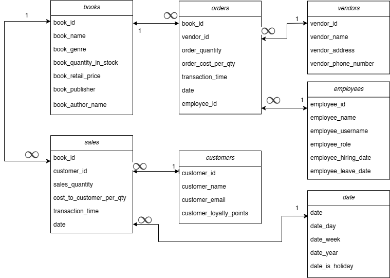
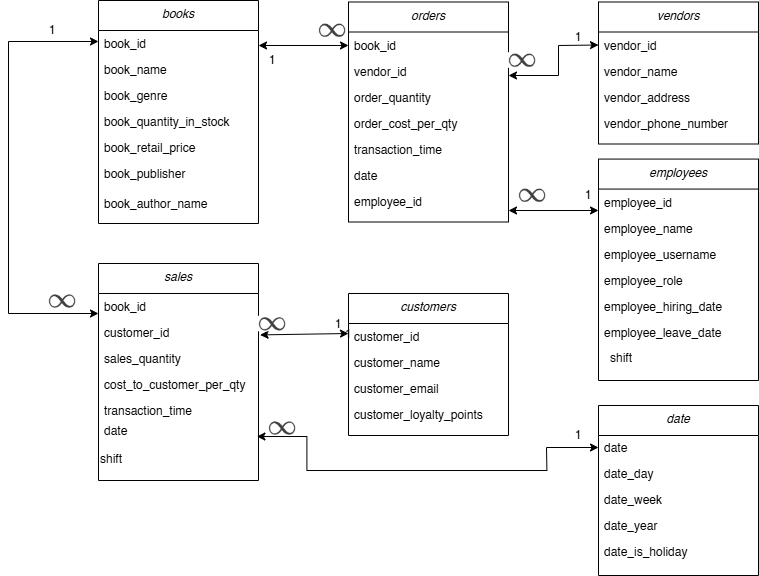
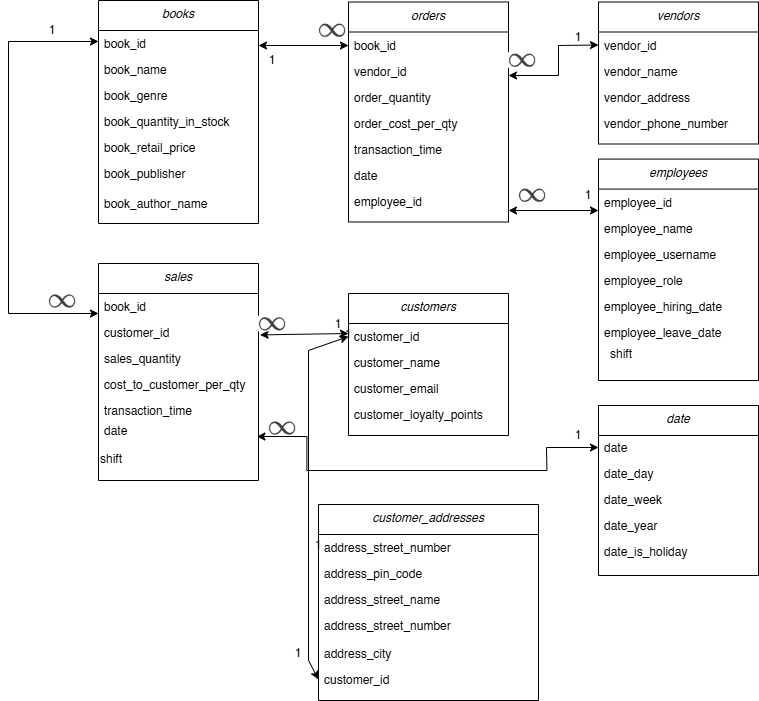
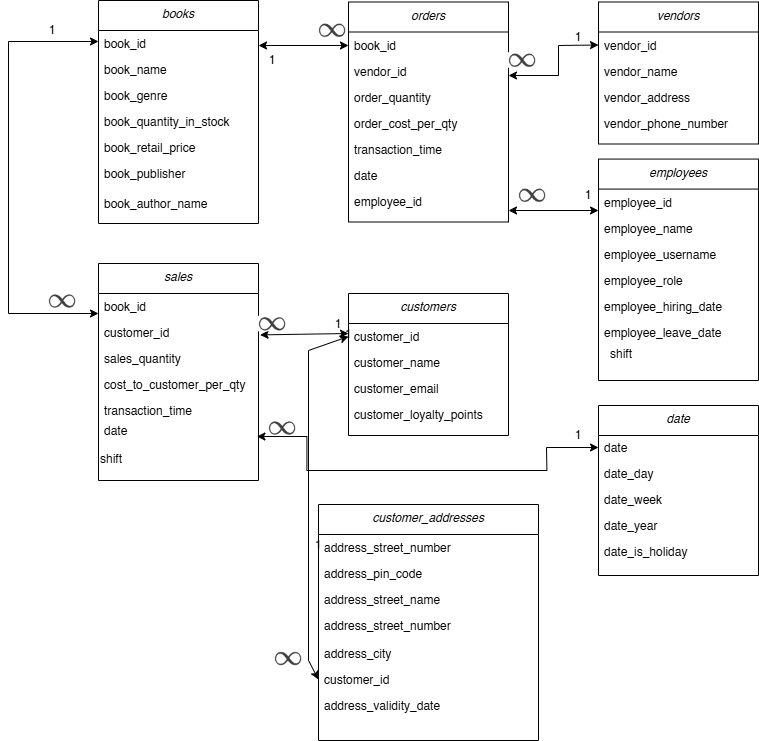

# Assignment 2: Design a Logical Model and Advanced SQL

🚨 **Please review our [Assignment Submission Guide](https://github.com/UofT-DSI/onboarding/blob/main/onboarding_documents/submissions.md)** 🚨 for detailed instructions on how to format, branch, and submit your work. Following these guidelines is crucial for your submissions to be evaluated correctly.

#### Submission Parameters:
* Submission Due Date: `February 1, 2025`
* Weight: 70% of total grade
* The branch name for your repo should be: `assignment-two`
* What to submit for this assignment:
    * This markdown (Assignment2.md) with written responses in Section 1 and 4
    * Two Entity-Relationship Diagrams (preferably in a pdf, jpeg, png format).
    * One .sql file 
* What the pull request link should look like for this assignment: `https://github.com/<your_github_username>/sql/pulls/<pr_id>`
    * Open a private window in your browser. Copy and paste the link to your pull request into the address bar. Make sure you can see your pull request properly. This helps the technical facilitator and learning support staff review your submission easily.

Checklist:
- [ ] Create a branch called `assignment-two`.
- [ ] Ensure that the repository is public.
- [ ] Review [the PR description guidelines](https://github.com/UofT-DSI/onboarding/blob/main/onboarding_documents/submissions.md#guidelines-for-pull-request-descriptions) and adhere to them.
- [ ] Verify that the link is accessible in a private browser window.

If you encounter any difficulties or have questions, please don't hesitate to reach out to our team via our Slack. Our Technical Facilitators and Learning Support staff are here to help you navigate any challenges.

***

## Section 1:
You can start this section following *session 1*, but you may want to wait until you feel comfortable wtih basic SQL query writing. 

Steps to complete this part of the assignment:
- Design a logical data model
- Duplicate the logical data model and add another table to it following the instructions
- Write, within this markdown file, an answer to Prompt 3


###  Design a Logical Model

#### Prompt 1
Design a logical model for a small bookstore. 📚

At the minimum it should have employee, order, sales, customer, and book entities (tables). Determine sensible column and table design based on what you know about these concepts. Keep it simple, but work out sensible relationships to keep tables reasonably sized. 

Additionally, include a date table. 

There are several tools online you can use, I'd recommend [Draw.io](https://www.drawio.com/) or [LucidChart](https://www.lucidchart.com/pages/).

**HINT:** You do not need to create any data for this prompt. This is a conceptual model only. 

##


```
We have 7 tables to keep track of
- books
- customers
- vendors
- employees
- sales
- orders
- date
```


#### Prompt 2
We want to create employee shifts, splitting up the day into morning and evening. Add this to the ERD.

##


```
Added shift columns in employees and sales table.
```

#### Prompt 3
The store wants to keep customer addresses. Propose two architectures for the CUSTOMER_ADDRESS table, one that will retain changes, and another that will overwrite. Which is type 1, which is type 2? 

**HINT:** search type 1 vs type 2 slowly changing dimensions. 

```
- type 1 keeps updating the details in the table. So there will always be only one entry per customer and hence the 1-1 relation with customer table.
```



```
- type 2 tracks the history of changes. So there may be multiple entries per for the same customer since they can move addresses. Therefore the many-1 relation with customer table.
```


***

## Section 2:
You can start this section following *session 4*.

Steps to complete this part of the assignment:
- Open the assignment2.sql file in DB Browser for SQLite:
	- from [Github](./02_activities/assignments/assignment2.sql)
	- or, from your local forked repository  
- Complete each question


### Write SQL

#### COALESCE
1. Our favourite manager wants a detailed long list of products, but is afraid of tables! We tell them, no problem! We can produce a list with all of the appropriate details. 

Using the following syntax you create our super cool and not at all needy manager a list:
```
SELECT 
product_name || ', ' || product_size|| ' (' || product_qty_type || ')'
FROM product
```

But wait! The product table has some bad data (a few NULL values). 
Find the NULLs and then using COALESCE, replace the NULL with a blank for the first problem, and 'unit' for the second problem. 

**HINT**: keep the syntax the same, but edited the correct components with the string. The `||` values concatenate the columns into strings. Edit the appropriate columns -- you're making two edits -- and the NULL rows will be fixed. All the other rows will remain the same.

<div align="center">-</div>

#### Windowed Functions
1. Write a query that selects from the customer_purchases table and numbers each customer’s visits to the farmer’s market (labeling each market date with a different number). Each customer’s first visit is labeled 1, second visit is labeled 2, etc. 

You can either display all rows in the customer_purchases table, with the counter changing on each new market date for each customer, or select only the unique market dates per customer (without purchase details) and number those visits. 

**HINT**: One of these approaches uses ROW_NUMBER() and one uses DENSE_RANK().

2. Reverse the numbering of the query from a part so each customer’s most recent visit is labeled 1, then write another query that uses this one as a subquery (or temp table) and filters the results to only the customer’s most recent visit.

3. Using a COUNT() window function, include a value along with each row of the customer_purchases table that indicates how many different times that customer has purchased that product_id.

<div align="center">-</div>

#### String manipulations
1. Some product names in the product table have descriptions like "Jar" or "Organic". These are separated from the product name with a hyphen. Create a column using SUBSTR (and a couple of other commands) that captures these, but is otherwise NULL. Remove any trailing or leading whitespaces. Don't just use a case statement for each product! 

| product_name               | description |
|----------------------------|-------------|
| Habanero Peppers - Organic | Organic     |

**HINT**: you might need to use INSTR(product_name,'-') to find the hyphens. INSTR will help split the column. 

<div align="center">-</div>

#### UNION
1. Using a UNION, write a query that displays the market dates with the highest and lowest total sales.

**HINT**: There are a possibly a few ways to do this query, but if you're struggling, try the following: 1) Create a CTE/Temp Table to find sales values grouped dates; 2) Create another CTE/Temp table with a rank windowed function on the previous query to create "best day" and "worst day"; 3) Query the second temp table twice, once for the best day, once for the worst day, with a UNION binding them. 

***

## Section 3:
You can start this section following *session 5*.

Steps to complete this part of the assignment:
- Open the assignment2.sql file in DB Browser for SQLite:
	- from [Github](./02_activities/assignments/assignment2.sql)
	- or, from your local forked repository  
- Complete each question

### Write SQL

#### Cross Join
1. Suppose every vendor in the `vendor_inventory` table had 5 of each of their products to sell to **every** customer on record. How much money would each vendor make per product? Show this by vendor_name and product name, rather than using the IDs.

**HINT**: Be sure you select only relevant columns and rows. Remember, CROSS JOIN will explode your table rows, so CROSS JOIN should likely be a subquery. Think a bit about the row counts: how many distinct vendors, product names are there (x)? How many customers are there (y). Before your final group by you should have the product of those two queries (x\*y). 

<div align="center">-</div>

#### INSERT
1. Create a new table "product_units". This table will contain only products where the `product_qty_type = 'unit'`. It should use all of the columns from the product table, as well as a new column for the `CURRENT_TIMESTAMP`.  Name the timestamp column `snapshot_timestamp`.

2. Using `INSERT`, add a new row to the product_unit table (with an updated timestamp). This can be any product you desire (e.g. add another record for Apple Pie). 

<div align="center">-</div>

#### DELETE 
1. Delete the older record for the whatever product you added.

**HINT**: If you don't specify a WHERE clause, [you are going to have a bad time](https://imgflip.com/i/8iq872).

<div align="center">-</div>

#### UPDATE
1. We want to add the current_quantity to the product_units table. First, add a new column, `current_quantity` to the table using the following syntax.
```
ALTER TABLE product_units
ADD current_quantity INT;
```

Then, using `UPDATE`, change the current_quantity equal to the **last** `quantity` value from the vendor_inventory details. 

**HINT**: This one is pretty hard. First, determine how to get the "last" quantity per product. Second, coalesce null values to 0 (if you don't have null values, figure out how to rearrange your query so you do.) Third, `SET current_quantity = (...your select statement...)`, remembering that WHERE can only accommodate one column. Finally, make sure you have a WHERE statement to update the right row, you'll need to use `product_units.product_id` to refer to the correct row within the product_units table. When you have all of these components, you can run the update statement.

*** 

## Section 4:
You can start this section anytime.

Steps to complete this part of the assignment:
- Read the article
- Write, within this markdown file, <1000 words.

### Ethics

Read: Boykis, V. (2019, October 16). _Neural nets are just people all the way down._ Normcore Tech. <br>
    https://vicki.substack.com/p/neural-nets-are-just-people-all-the

**What are the ethical issues important to this story?**

Consider, for example, concepts of labour, bias, LLM proliferation, moderating content, intersection of technology and society, ect. 


```
Essay below
```
## Ethical Considerations in Artificial Intelligence

``As a large language model..." has been an increasingly encountered sentence in articles recently. Artificial Intelligence (AI) is shaping everyday life, from the recommendations on Netflix to the complex decision-making in healthcare and finance. While AI promises efficiency and automation, it also raises profound ethical dilemmas that affect workers, marginalized communities, and creative professionals. The influence of AI extends across multiple industries, often in ways that are not immediately visible. The ethical concerns discussed in this essay—labour exploitation, bias in moderation, and the impact of AI on creative labour—are drawn in part from the work of **Boykis (2019)**, who argues that AI systems are deeply dependent on human labour, yet this dependency is often obscured. By analysing these key concerns, this essay will propose potential solutions to mitigate the harms associated with AI.

**Boykis (2019)** proposes the notion that AI is not purely autonomous but is instead built upon a foundation of extensive, human-driven tasks that remain largely invisible to users. AI systems heavily rely on human labour, particularly in data labelling, annotation, and content moderation. **Altenried et al. (2024)** argue that this labour is often hidden, performed by precarious crowd workers who lack job security, benefits, or minimum wage protections. These workers, primarily from developing countries across the world, experience algorithmic control and surveillance, which restricts their autonomy and exacerbates global labour inequalities. Ethical discussions around AI must extend beyond fairness in model design to encompass labour conditions in AI production. This concern is closely tied to the necessity of human-AI collaboration. 

**Lai et al. (2023)** further emphasises this point, arguing that instead of fully automating AI decision-making, human oversight must be incorporated into AI moderation systems. AI models struggle with out-of-distribution data, leading to significant errors that can disproportionately impact certain groups. For example, AI-driven recruitment tools have exhibited algorithmic bias, leading to discriminatory hiring practices based on gender, race, colour, and personality traits (**Chen, 2023**). These biases stem from limited raw data sets and the subjective decisions of algorithm designers. This has resulted in cases where highly qualified candidates were unfairly rejected, not due to their actual abilities but because their profiles did not align with the flawed patterns recognized by the AI, thereby reinforcing systemic inequalities rather than addressing them (**Chen, 2023**). 

Similarly, bias in AI-driven content moderation systems is another significant ethical concern. While these systems claim to be neutral, they often reinforce existing biases present in training data. **Gillespie et al. (2022)** highlight how automated moderation disproportionately misidentifies content from marginalized groups, failing to account for cultural and contextual nuances. AI moderation prioritizes efficiency over ethical considerations, primarily serving corporate interests rather than ensuring fair and unbiased digital environments. The reliance on AI for large-scale moderation poses risks to human rights, as certain voices may be censored unjustly. A key challenge is the opacity of AI decision-making, which shields corporations from scrutiny and makes it difficult to address embedded biases (**Lai et al., 2023**). **Nahmias & Perel (2020)** examine the ethical implications of AI-driven content moderation and the lack of corporate accountability. Many AI impact assessments remain self-regulated, limiting transparency and public oversight. **Boykis (2019)** further critiques the reliance on AI moderation, illustrating how its dependence on training data replicates existing power structures rather than dismantling them. **Nahmias and Perel (2020)** call for dual oversight—internal corporate checks and external audits—to ensure AI operates ethically and fairly. Transparent AI systems with human oversight are essential, reinforcing the argument that human judgment remains critical in ethical AI development and decision-making (**Chen, 2023**).

**Boykis (2019)** highlights AI’s fundamental limitations, noting that even seemingly simple tasks, like making a set of pyjamas, still require human intervention. Yet, paradoxically, as **Roose (2022)** points out, AI is replacing jobs in creative industries, with AI-generated images winning painting competitions and raising concerns about artistic integrity. Ironically, the triumphant AI-generated art may itself be the result of human labour, as the datasets used to train such models are often painstakingly labelled by underpaid workers. This contradiction underscores the real debate: not whether AI can fully replicate human skill, but how its increasing role in creative fields is reshaping labour dynamics.

A paper by **Bakshi et al. (2015)** discusses how AI automation poses risks to creative jobs, even as it fails to replicate the depth of human creativity. While AI can assist in creative processes, ethical concerns arise regarding ownership, originality, and the long-term sustainability of creative professions. **Lee (2022)** argues that AI-generated content threatens professional artists and cultural workers, as economic frameworks prioritize efficiency over artistic labour. Additionally, intellectual property laws favour corporations rather than individual creators, reinforcing economic inequalities. The commodification of creativity by AI-driven systems underscores the need for fair compensation and recognition of human contributions in creative fields. This further complicates the ethical debate, as AI-generated content is not truly independent of human effort but rather built upon an exploited workforce, making the commodification of creativity even more ethically fraught (**Bakshi et al., 2015**). 

A recurring theme across these ethical issues is the imbalance of power between AI developers, corporations, and end-users. AI systems tend to reinforce existing inequalities, whether through exploitative labour practices, biased moderation, or the devaluation of human creativity. Addressing these concerns requires establishing fair wages and working conditions for AI data annotators and moderators to ensure ethical AI production (**Altenried et al., 2014; Gillespie et al., 2022**). Additionally, AI companies must be held accountable for biased decision-making through external audits and clear explanations of AI processes. Incorporating human oversight in AI decision-making can reduce errors and improve fairness in automated processes (**Gillespie et al., 2022; Lai et al., 2023**). 

As AI continues to shape industries and societies, addressing its ethical challenges remains imperative. Labour exploitation, bias in moderation, creative industry disruptions, and corporate accountability highlight the complexities of AI ethics. While AI promises efficiency, it must not come at the cost of fairness, transparency, and human dignity. Through labour protections, ethical AI governance, and increased human oversight, it is possible to develop AI systems that serve society equitably. The future of AI must be guided not only by technological advancement but also by ethical responsibility and inclusivity. 

### References
- Altenried, M. (2020). The platform as factory: Crowdwork and the hidden labour behind artificial intelligence. Capital & Class, 44(2), 145–158. https://doi.org/10.1177/0309816819899410
- Bakhshi, H., Frey, C. B., & Osbourne, M. (2015). Creativity vs robots: The creative economy and the future of employment.
- Boykis, V. (2019, October 16). _Neural nets are just people all the way down._ Normcore Tech. <br>  https://vicki.substack.com/p/neural-nets-are-just-people-all-the
- Chen, Z. (2023). Ethics and discrimination in artificial intelligence-enabled recruitment practices. Humanities and Social Sciences Communications, 10(1), 1-12.
- Gillespie, T. (2020). Content moderation, AI, and the question of scale. Big Data & Society, 7(2), 1-5. https://doi.org/10.1177/2053951720943234
- Lai, V., Carton, S., Bhatnagar, R., Liao, Q. V., Zhang, Y., Tan, C., Barbosa, S., Appert, C., Lampe, C., Shamma, D. A., Yatani, K., Drucker, S., & Williamson, J. (2022). Human-AI Collaboration via Conditional Delegation: A Case Study of Content Moderation. CHI Conference on Human Factors in Computing Systems, 1–18. https://doi.org/10.1145/3491102.3501999
- Lee, H.-K. (2022). Rethinking creativity: creative industries, AI and everyday creativity. Media, Culture & Society, 44(3), 601–612. https://doi.org/10.1177/01634437221077009
- Nahmias, Y., & Perel, M. (2021). The Oversight of Content Moderation By AI: Impact Assessments and Their Limitations. Harvard Journal on Legislation, 58(1), 145.
- Roose, K. (2022). An A.I.-Generated Picture Won an Art Prize. Artists Aren’t Happy: The Shift. New York Times (Online).